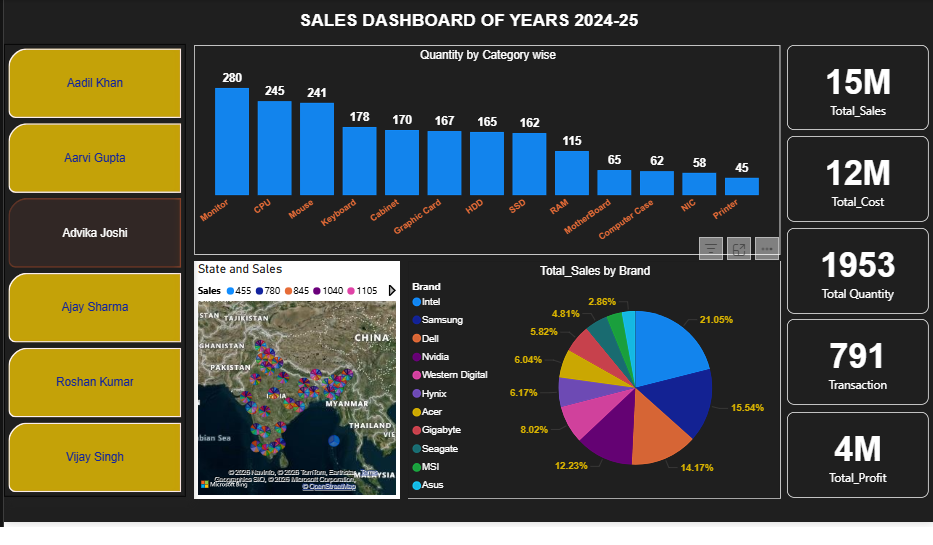

# Sales-Data-Analysis-Dashboard-Power-BI  
📊 **Sales Dashboard (2024–25)**  
📌 **Overview**  
This project presents an interactive Sales Analysis Dashboard built in Power BI to monitor business performance for the years 2024–25.
The dashboard provides insights into sales, profit, quantity, brand performance, and state-wise distribution to support data-driven decision-making.

🛠 **Tools Used :-**  
* Power BI Desktop  
* Power Query  
* DAX  
* Excel / CSV Dataset  

📊 **Key Metrics:-**
* Total Sales: 16M  
* Total Cost: 12M  
* Total Profit: 4M  
* Total Quantity: 2032  
* Total Transactions: 798  

📈 **Dashboard Highlights:-**  
* Quantity by Product Category  
* Brand-wise Sales Distribution  
* State-wise Sales Map (India)  
* Supervisor-level Performance Filter  
* Interactive KPIs and Visualizations  

🚀 **How to Use :-**  
* Download the .pbix file  
* Open in Power BI Desktop  
* Use filters and slicers to explore insights  

📸 **Preview**

👨‍💻 **Author**  
Vipul Alsundkar  
Data Analyst | SQL | Excel | Power BI  
📍 Pune, Maharashtra  
🔗 LinkedIn: https://linkedin.com/in/vipul-alsundkar-6891593a0  
🔗 GitHub: https://github.com/vipul892  
